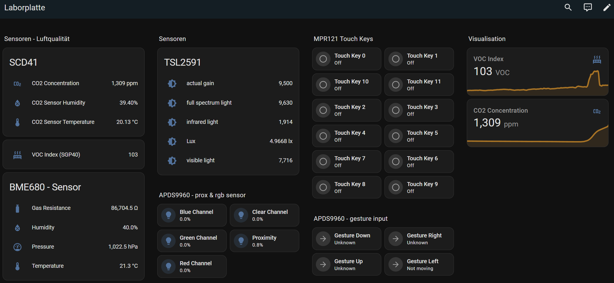

# APL: ESPHome/HomeAssistant
- Aufgabe: YAML-Beschreibung für die Laborplatte für die Kompatibilität mit ESPHome und Integration in HA
    - Sensoren als Sensoren in HA
    - Taster&Co als Taster in HA
    - falls geht Display

- Vorrausetzung:
    - bestehende Home Assistant Instanz
- verwendete Home Assistant Installation
    - VM in Proxmox with OS Version: Home Assistant OS 14.1
    - Home Assistant Core: 2024.12.4

# Laborplatte mit ESP + Sensoren

- **ESP**: BPI-Leaf-S3: basic development board equipped with ESP32-S3R2 chip
    - with a TCA9548A I²C Multiplexer

**I2C - Clients:**
- OLED Display 128x64
    - Adafruit FeatherWing OLED
- [Rotary Encoder](https://learn.adafruit.com/adafruit-ano-rotary-navigation-encoder-to-i2c-stemma-qt-adapter?view=all)
    - 5 Tasten
    - Drehrad decrease/increase einer Zahl
- MPR121
    - 12 Touch-Tasten
    - simple test py script geht nicht
        - Datei "mpr121_simpletest_mux.py", Zeile 17, in <module> 
        - ValueError: IO16 in Benutzung
- ST25DV16k
    - https://www.st.com/en/nfc/st25dv16k.html
    - NFC Tag
- BME680
    - https://www.bosch-sensortec.com/products/environmental-sensors/gas-sensors/bme680/
    - Temperatur, Luftdruck, Feuchtigkeit
    - Raumluftqualität: VOC (volatile organic compounds)
- SGP40
    - Raumluftqualität: VOC (volatile organic compounds)
- SCD41
    - CO2 Sensor
- PCF8523
    - https://www.nxp.com/docs/en/data-sheet/PCF8523.pdf
    - Real-Time Clock (RTC)
- TSL2591
    - https://cdn-shop.adafruit.com/datasheets/TSL25911_Datasheet_EN_v1.pdf
    - Umgebungslicht (Lux)
- APDS9960
    - https://www.mouser.de/datasheet/2/678/V02-4191EN_DS_APDS-9960_2015-11-13-909346.pdf
    - Digital Proximity, Ambient Light, RGB and Gesture Sensor
    - Gesten: links, rechts, hoch, runter, Abstand

# ESPHome
- https://esphome.io/guides/getting_started_hassio
- ESPHome: allows to write configurations + turn microcontrollers into smart home devices
    - reads a YAML configuration file, creates custom firmware, can install it directly on the device
    - Any devices/sensors defined in ESPHome configuration will automatically appear in Home Assistant's user interface
- Add ESPHome Addon (ESPHome Device Builder) to HA 
    - `https://<your_ha_url>/hassio/addon/5c53de3b_esphome/info`
- Start Addon > Open Web Interface

## Setting up the new ESPHome Device
- Add new device
    - Name: Laborplatte
    - enter wlan ssid and wpa key
    - Skip
    - select ESP32-S3

- select the right ESP32 Platform: [ESP32 Platform — ESPHome](https://esphome.io/components/esp32.html#configuration-variables)
    - [BPI-Leaf-S3 — PlatformIO latest documentation](https://docs.platformio.org/en/latest/boards/espressif32/bpi_leaf_s3.html#configuration)
    - `board: bpi_leaf_s3` --> geht nicht, also `board: esp32-s3-devkitc-1`

- Inside the ESPHome Dashboard should be a new YAML-Configuration for "Laborplatte"
    - select EDIT
    - it should look like something like this
```yaml
esphome:
  name: laborplatte
  friendly_name: Laborplatte

esp32:
  board: esp32-s3-devkitc-1
  framework:
    type: arduino

# Enable logging
logger:

# Enable Home Assistant API
api:
  encryption:
    key: "XXXX"

ota:
  - platform: esphome
    password: "XXXX"

wifi:
  ssid: !secret wifi_ssid
  password: !secret wifi_password

  # Enable fallback hotspot (captive portal) in case wifi connection fails
  ap:
    ssid: "Laborplatte Fallback Hotspot"
    password: "XXXX"

captive_portal:
```

## Initial configuration
- Installation requires that the ESP device is connected with a cable to a computer
    - Later updates can be installed wirelessly

- Board mit PC verbinden
    - am Board BOOT gedrückt halten plus kurz RST drücken, danach BOOT loslassen
    - select laborplatte.yaml --> select COM-Port of the ESP-Device --> install

## Creating the yaml in ESPHome configuration
1. Define the I²C bus in the configuration
    - to find out the correct GPIO-Pins: look at Troubleshooting below
```yaml
i2c:
  sda: GPIOXX
  scl: GPIOXX
  scan: true
  id: bus_a
```

### Implementing the sensor configuration
- Just edit: laborplatte.yaml
- Starting with the I2C Multiplexer definition

---
**TCA9548A Multiplexer** is an 4-channel I2C multiplexer that allows you to connect multiple I2C devices with the same address to a single I2C bus
- Configuration Variables
    - **address** (*Required*, int): The I2C address of the TCA9548A. Default is 0x70.
    - **id** (*Required*, string): Identifier for the multiplexer.
    - **i2c_id** (*Required*, string): ID of the I2C bus the multiplexer is connected to.
    - **channels** (*Required*, list): List of channel configurations:
    - **bus_id** (*Required*, string): Unique identifier for the channel
    * **channel** (*Required*, int): Channel number (0-7)
```yaml
...

i2c:
  - id: bus_a
    sda: 15
    scl: 16
    scan: true

# TCA9548A Multiplexer
tca9548a:
  - address: 0x70
    id: multiplex0
    i2c_id: bus_a
    channels:
      - bus_id: multiplex0channel0
        channel: 0
      - bus_id: multiplex0channel1
        channel: 1
      - bus_id: multiplex0channel2
        channel: 2
      - bus_id: multiplex0channel3
        channel: 3
```
---
**BME680 - Air Quality Sensor**
- (Channel 0, Address 0x77)
- [ESPHome - BME680](https://esphome.io/components/sensor/bme680.html#bme680-temperature-pressure-humidity-gas-sensor)
```yaml
sensor:
  - platform: bme680
    temperature:
      name: "Temperature Channel 0"
      id: bme680_temperature
    humidity:
      name: "Humidity Channel 0"
      id: bme680_humidity
    pressure:
      name: "Pressure Channel 0"
    gas_resistance:
      name: "Gas Resistance Channel 0"
    address: 0x77
    i2c_id: multiplex0channel0
```
- **Advanced Configuration**: Add indoor air quality (IAQ)
    - based on the values in the BME680 [BSEC component](https://esphome.io/components/sensor/bme680_bsec#index-for-air-quality-iaq-measurement) index

```yaml
sensor:
# BME680 - Air Quality Sensor (Channel 0, Address 0x77)
  - platform: bme680
    temperature:
      name: "Temperature Channel 0"
      id: bme680_temperature
    humidity:
      name: "Humidity Channel 0"
      id: bme680_humidity
    pressure:
      name: "Pressure Channel 0"
      id: bme680_pressure
    gas_resistance:
      name: "Gas Resistance Channel 0"
      id: bme680_gas_resistance
    address: 0x77
    i2c_id: multiplex0channel0
  # advanced configuration
  - platform: template
    name: "BME680 Indoor Air Quality"
    id: iaq
    icon: "mdi:gauge"
    # calculation: comp_gas = log(R_gas[ohm]) + 0.04 log(Ohm)/%rh * hum[%rh]
    lambda: |-
      return log(id(bme680_gas_resistance).state) + 0.04 *  id(bme680_humidity).state;
    state_class: "measurement"

# text sensor for advanced configuration of the bme680 sensor
text_sensor:
  - platform: template
    name: "BME680 IAQ Classification"
    icon: "mdi:checkbox-marked-circle-outline"
    lambda: |-
      if (int(id(iaq).state) <= 50) {
        return {"Excellent"};
      }
      else if (int(id(iaq).state) <= 100) {
        return {"Good"};
      }
      else if (int(id(iaq).state) <= 150) {
        return {"Lightly polluted"};
      }
      else if (int(id(iaq).state) <= 200) {
        return {"Moderately polluted"};
      }
      else if (int(id(iaq).state) <= 250) {
        return {"Heavily polluted"};
      }
      else if (int(id(iaq).state) <= 350) {
        return {"Severely polluted"};
      }
      else if (int(id(iaq).state) <= 500) {
        return {"Extremely polluted"};
      }
      else {
        return {"unknown"};
      }
```
- Add as "Badge" to the Home Assistant Dashboard

    
---
 

**SGP40 - Gas Sensor**
- Volatile Organic Compound (VOC) Sensor
- [ESPHome - SGP40](https://esphome.io/components/sensor/sgp4x.html) 
- Sensor outputs a **VOC index** (0 to 500), where 100 represents average air quality.
    - **100-500**: Air quality is deteriorating.
    - **0-100**: Air quality is improving.
    - **VOC Algorithm**:  Sensirion's VOC algorithm runs on an independent microcontroller, processing measured values to calculate a 24-hour average. This average is assigned a VOC index of 100. The algorithm converts measured values into a VOC index within the 0–500 range, updating every second.
    - **Automatic Humidity Compensation**: The sensor supports automatic humidity compensation. By sending the `sgp40_measure_raw` command with the current relative humidity and temperature (instead of the default 50% and 25°C), accuracy can be improved. Sensirion recommends enabling this feature in dry environments with absolute humidity below **5 g/m³**.
- VOC: organic chemicals that easily evaporate into the air at room temperature
- VOC Index Scale:
    - 0-100: Excellent air quality
    - 100-200: Good air quality  
    - 200-300: Moderate air quality
    - 300-400: Poor air quality
    - 400-500: Very poor air quality
- Common VOC Sources:
    - Cleaning products
    - Paints and varnishes  
    - Air fresheners
    - New furniture
    - Carpeting
    - Cooking activities
    - Personal care products
- Sensor calibration:
    - SGP40 requires several hours of initial runtime to establish accurate baseline readings through self-calibration algorithms. For best results, allow the sensor to calibrate in its intended operating environment
    - I use the BME680 sensor for external calibration
```yaml
  - platform: sgp4x
    voc:
      name: "VOC Index"
    compensation:
      humidity_source: bme680_humidity
      temperature_source: bme680_temperature
    i2c_id: multiplex0channel0
```
---
**SCD4X CO₂ Sensor**
- CO₂, Temperature and Relative Humidity Sensor
- [SCD41 - ESPHome](https://esphome.io/components/sensor/scd4x.html#scd4x-co2-temperature-and-relative-humidity-sensor)

```yaml
sensor:
# SCD41 - CO2 Sensor (Channel 0, Address 0x62)
  - platform: scd4x
    temperature:
      name: "CO2 Sensor Temperature"
    humidity:
      name: "CO2 Sensor Humidity"
    co2:
      name: "CO2 Concentration"
      id: co2_sensor
    address: 0x62
    i2c_id: multiplex0channel0
```
---
**TSL2591 - Ambient Light Sensor**
- [TSL2591 - ESPHome](https://esphome.io/components/sensor/tsl2591.html#tsl2591-ambient-light-sensor)

```yaml
sensor:
  - platform: tsl2591
    address: 0x29
    i2c_id: multiplex0channel0
    name: "Ambient Light Channel 0"
    update_interval: 60s
    gain: auto
    device_factor: 53
    glass_attenuation_factor: 14.4
    visible:
      name: "TSL2591 visible light"
    infrared:
      name: "TSL2591 infrared light"
    full_spectrum:
      name: "TSL2591 full spectrum light"
    calculated_lux:
      id: i_lux
      name: "TSL2591 Lux"
    actual_gain:
      id: "actual_gain"
      name: "TSL2591 actual gain"
```
---

### Adding the Input Controls
- gesture and capacitive touch sensors
- rotary encoder

**MPR121 Touch Sensor**
- Capacitive Touch Sensor with 12 touch-sensitive inputs
- [MPR121 - ESPHome](https://esphome.io/components/binary_sensor/mpr121.html)
- detect touch events on each input pin and publish them as binary sensors in Home Assistant

```yaml
# MPR121 Component Capacitive Touch Sensor
# MPR121 Component
mpr121:
  id: mpr121_component
  address: 0x5A
  i2c_id: multiplex0channel0  # Link to the TCA9548A Channel 0
  touch_debounce: 1
  release_debounce: 1
  touch_threshold: 10
  release_threshold: 7

# Binary Sensors for MPR121 Channels
binary_sensor:
  - platform: mpr121
    id: touch_key0
    channel: 0
    name: "Touch Key 0"
    touch_threshold: 12
    release_threshold: 6

  - platform: mpr121
    id: touch_key1
    channel: 1
    name: "Touch Key 1"

  - platform: mpr121
    id: touch_key2
    channel: 2
    name: "Touch Key 2"

  - platform: mpr121
    id: touch_key3
    channel: 3
    name: "Touch Key 3"

  - platform: mpr121
    id: touch_key4
    channel: 4
    name: "Touch Key 4"

  - platform: mpr121
    id: touch_key5
    channel: 5
    name: "Touch Key 5"

  - platform: mpr121
    id: touch_key6
    channel: 6
    name: "Touch Key 6"

  - platform: mpr121
    id: touch_key7
    channel: 7
    name: "Touch Key 7"

  - platform: mpr121
    id: touch_key8
    channel: 8
    name: "Touch Key 8"

  - platform: mpr121
    id: touch_key9
    channel: 9
    name: "Touch Key 9"

  - platform: mpr121
    id: touch_key10
    channel: 10
    name: "Touch Key 10"

  - platform: mpr121
    id: touch_key11
    channel: 11
    name: "Touch Key 11"
```

**APDS9960 Sensor**
- RGB and gesture sensor
- [APDS9960 - ESPHome](https://esphome.io/components/sensor/apds9960.html)
- multi-function sensor
- Gesture Detection
    - recognize simple hand gestures like up, down, left, right
    - Useful for touchless control interfaces
    - Works by detecting motion direction using infrared light
- Proximity Sensing
    - PROXIMITY sensor: detects the presence and distance of nearby objects by measuring the reflection of infrared light emitted by the sensor's IR LED
- RGB Color Sensing
    - CLEAR channel: measures the total light intensity across the visible spectrum, without distinguishing between colors (ambient brightness)
    - RED, GREEN, BLUE Channels: measure the intensity of light in the red, green, and blue parts of the visible spectrum
- Steps to Adjust Sensitivity
    - by tweaking the ambient light gain and the LED drive level
    - settings allow to make the sensor more responsive to changes in light intensity
    - ambient_light_gain: 16x  # Options: 1x, 4x, 16x, 64x (default: 4x)
```yaml
# APDS9960 Sensor Component
apds9960:
  id: apds9960_component
  address: 0x39
  i2c_id: multiplex0channel0
  update_interval: 60s
  led_drive: 100mA
  proximity_gain: 4x
  ambient_light_gain: 4x
  gesture_led_drive: 100mA
  gesture_gain: 4x
  gesture_wait_time: 2.8ms

# Light and Proximity Sensors
sensor:
  - platform: apds9960
    type: CLEAR
    name: "APDS9960 Clear Channel"
  - platform: apds9960
    type: RED
    name: "APDS9960 Red Channel"
  - platform: apds9960
    type: GREEN
    name: "APDS9960 Green Channel"
  - platform: apds9960
    type: BLUE
    name: "APDS9960 Blue Channel"
  - platform: apds9960
    type: PROXIMITY
    name: "APDS9960 Proximity"

# Gesture Detection
binary_sensor:
  - platform: apds9960
    direction: UP
    name: "APDS9960 Gesture Up"
  - platform: apds9960
    direction: DOWN
    name: "APDS9960 Gesture Down"
  - platform: apds9960
    direction: LEFT
    name: "APDS9960 Gesture Left"
  - platform: apds9960
    direction: RIGHT
    name: "APDS9960 Gesture Right"
```

**Rotary Encoder Sensor**
- [Rotary Encoder Sensor - ESPHome](https://esphome.io/components/sensor/rotary_encoder.html)
- [Adafruit ANO Rotary Encoder I2C seesaw](https://learn.adafruit.com/adafruit-ano-rotary-navigation-encoder-to-i2c-stemma-qt-adapter?view=all)

- **sadly no I2C support for rotary encoder in ESPHome yet**
    - https://community.home-assistant.io/t/i2c-rotary-encoder-in-esphome/628966

### Configure OLED-Display
- Adafruit FeatherWing OLED (128x64)
    - model: SH1107 128x64-oled
- [SH1107 I2C - ESPHome](https://esphome.io/components/display/ssd1306.html#over-i2c)

1. define a font
```yaml
# Define Font
font:
  - file: "https://github.com/IdreesInc/Monocraft/releases/download/v3.0/Monocraft.ttf"
    id: web_font
    size: 9
  - file:
      type: gfonts
      family: Roboto
      weight: 900
    id: roboto_16
    size: 16
```
2. configure i2c display
- important to set rotation to 90°/270° and offset to 96
```yaml
# Display: SH1107 128x64-oled
# Address: 0x3c 
display:
  - platform: ssd1306_i2c
    i2c_id: bus_a
    address: 0x3c
    id: device_display
    update_interval: 10s
    rotation: 90
    offset_y: 96
    model: "SH1107 128x64"
    pages:
      - id: page1
        lambda: |-
          // Page 1: Temperature, Humidity, Pressure, Gas Resistance
          it.printf(0, 0, id(web_font), "Temp: %.1f C", id(bme680_temperature).state);
          it.printf(0, 20, id(web_font), "Humidity: %.1f %%", id(bme680_humidity).state);
          it.printf(0, 40, id(web_font), "Pressure: %.1f hPa", id(bme680_pressure).state);
          it.printf(0, 60, id(web_font), "Gas: %.0f Ohm", id(bme680_gas_resistance).state);
      - id: page2
        lambda: |-
          // Page 2: VOC Index and CO2 Levels
          it.printf(0, 0, id(roboto_16), "VOC Index: %.1f", id(sgp40_voc).state);
          it.printf(0, 20, id(roboto_16), "CO2: %.1f ppm", id(co2_sensor).state);

```
3. switch between pages with touching button
- add functionality to MPR121 sensor in yaml
- press button 6 for changing the display page
```yaml
sensor:
  - platform: mpr121
    id: touch_key6
    channel: 6
    name: "Touch Key 6"
    on_press:
      then:
        - display.page.show_next: device_display
        - component.update: device_display
```


4. for more configuration options look up the official documentation [Display - ESPHome](https://esphome.io/components/display/#display-engine)

### Connecting the ESP device to Home Assistant
- prerequisites:
    - device is initialized with the yaml
    - device is online
- device should be now automatically discovered
    - Settings > Devices & services > Add Integration "ESPHome"
- HA: create new dashboard
    - raw configuration editor
    - copy/paste content from `raw_configuration_ha.yaml`
```yaml
views:
  - title: Laborplatte
    sections:
      - type: grid
        cards:
          - type: heading
            heading: Sensoren
            heading_style: title
          - type: entities
            entities:
              - entity: sensor.laborplatte_bme680_gas_resistance
                name: BME680 Gas Resistance
              - entity: sensor.laborplatte_bme680_humidity
                name: BME680 Humidity
              - entity: sensor.laborplatte_bme680_pressure
                name: BME680 Pressure
              - entity: sensor.laborplatte_bme680_temperature
                name: BME680 Temperature
            title: Laborplatte
    cards: []
...
...
```
- Should now be looking something like this:

- if you click on a specific sensor you can see the value history:


# Troubleshooting
- Fixing the I2C Connection Problem
- Issue: Finding the right SDA and SCL GPIO Pins
    - [i2c.arduino:096]: Results from i2c bus scan:
    - [i2c.arduino:098]: Found no i2c devices!

## Debugging with Circuit-Python
- Flash the ESP32-S3 with Circuit-Python Firmware
- Board mit PC verbinden
    - Website aufrufen (Online ESP-Tool): https://adafruit.github.io/Adafruit_WebSerial_ESPTool/
    - am Board BOOT gedrückt halten plus kurz RST drücken, danach BOOT loslassen und connect im ESPTool drücken!
    - Choose File > `CP-Bootloaderv20.1+CPv9.2/combined.bin` > Program
    - Reset the Device: RST drücken
- Flash the new firmware
    - copy `adafruit-circuitpython-bpi_leaf_s3-de_DE-9.2.0.uf2` into the root-Verzeichnis

- Delete all existing files from `CIRCUITPY (E:)`
    - copy the python-scripts (e.g. "i2cscan.py") to root

### prepare IDE
Code with Mu
    - [Download Mu](https://codewith.mu/en/download)
- select Mode: CircuitPython
- theme: activate darkmode
- open Folder E: --> `code.py`
    - serial -> inside the serial window `Strg+D` to reload script

### i2c testen + script
- testing the script: `i2cscan.py`
```py
...
print(f"SDA pin: {board.SDA}")
print(f"SCL pin: {board.SCL}")
```
 **i2cscan.py Ausgabe:**

```py
I2C addresses - direct: ['0x3c', '0x70']
I2C addresses - Bus 0 : ['0x29', '0x39', '0x49', '0x59', '0x5a', '0x62', '0x68', '0x77']
I2C addresses - Bus 1 : []
I2C addresses - Bus 2 : ['0x2d', '0x53', '0x57']
I2C addresses - Bus 3 : []
x/0x70 TCA9548A
x/0x3c SH1107 128x64-oled
0/0x68 PCF8523
0/0x29 TSL2591 or VL53L4CD
0/0x39 APDS9960 or AS7341
0/0x77 BME680
0/0x5a MPR121
0/0x62 SCD4x
0/0x59 SGP40
0/0x49 seesaw ANO
2/0x53 ENS160 or LTR390 or ST25DV16k (system memory)
2/0x2d ST25DV16k (Control)
2/0x57 ST25DV16k (user memory)

SDA pin: board.IO15
SCL pin: board.IO16
```

Finally: the correct GPIO-Pins for SDA and SCL are **IO15** and **IO16**